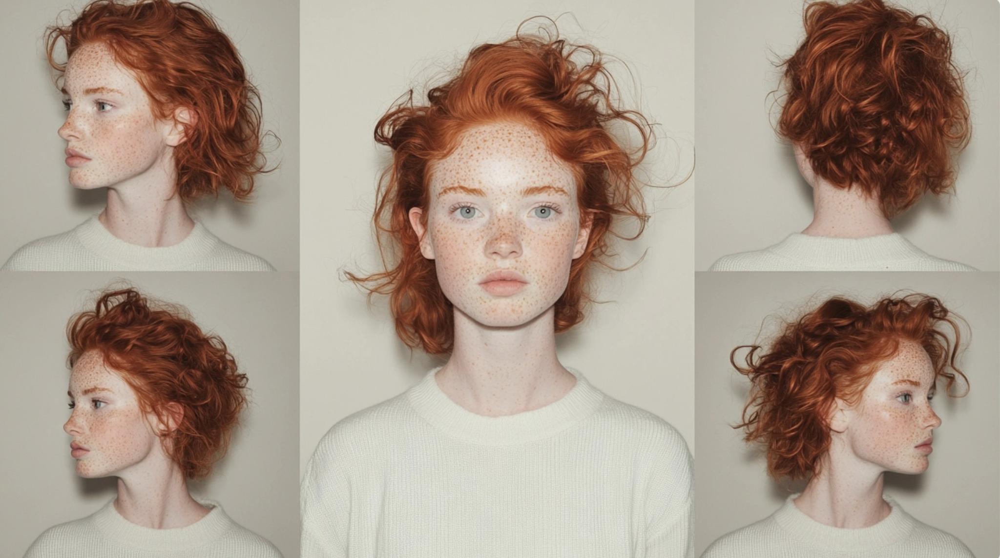
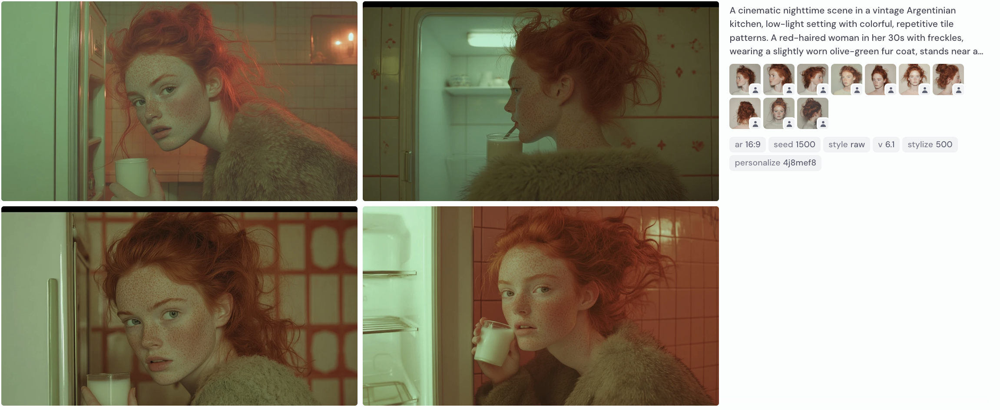

<style>.md-footer{display:none;}</style>
<style>.md-header{display:none;}</style>
*Le but de cet exercice est de créer un personnage sous différents angles.

***


## Étapes pour Générer un Personnage Consistant dans Midjourney

Pour commencer, utilisez l’outil [Glibatree Consistent Character Assistant](https://chatgpt.com/g/g-hfOosvOH7-glibatree-consistent-character-assistant) pour générer des prompts optimisés et créer un personnage cohérent. Suivez chaque étape pour obtenir des résultats uniformes et réalistes.

### 1. **Rédiger un prompt décrivant le personnage pour le collage initial**
  - [x] **Description détaillée** : Décrivez le personnage en fonction des traits physiques souhaités. Mentionnez des éléments comme la couleur et la texture des cheveux, le teint, la couleur des yeux, l’âge, les vêtements et une description subtile de la posture ou de l’expression.<br>
  - [x] **Création du collage de référence** : Utilisez un prompt pour générer un collage de six portraits, avec des variations d'expressions, d'angles et de légères différences de posture. Cela servira de référence visuelle pour maintenir la cohérence dans d’autres images.<br>

**Exemple de prompt pour le collage** :<br>

      ```Midjourney
      A six-panel photo collage of a woman, 30 years old, red hair, freckles on her face, wearing simple everyday clothes. Standing in front of a plain solid background with studio lighting. Candid cell-phone photography, highlighting the beauty of imperfections. The person is moving, turning, and getting slightly happier in each frame. Closeup photos. ::3 
      Painting, artistic, bokeh with beautiful ambience ::-1 
      evenly-spaced photo grid with deep color tone ::1 --style raw --ar 16:9
      ```
   - **Remarque** : Assurez-vous que le style est en mode `--style raw` pour un rendu réaliste.<br>

### 2. **Générer le prompt dans Midjourney**
  - [x] **Vérifier les réglages** : Confirmez que le style est bien défini sur `--style raw` pour conserver la netteté et les détails réalistes.<br>
  - [x] **Lancer la génération** : Utilisez le prompt dans Midjourney pour obtenir le collage. Choisissez l’option de **Subtle Upscale** sur l’image la plus réussie pour améliorer la qualité sans trop de changements.<br>

### 3. **Découper les images dans Midjourney**
  - [x] **Découpage des portraits individuels** : Sélectionnez chaque portrait du collage pour capturer les variations distinctes du personnage. Cela peut se faire en **enregistrant chaque image** individuellement ou en utilisant un outil de capture d’écran pour isoler les portraits.<br>
  - [x] **Préparer les références pour une utilisation future** : Conservez les images découpées dans une bibliothèque de référence que vous pourrez utiliser dans les étapes suivantes.<br>

Le but de cet exercice est de créer un arrière plan

***

### 4. **Réinsérer les images dans Midjourney et générer un prompt avec un arrière-plan**<br>
  - [x] **Insérer les images de référence** : Dans Midjourney, insérez trois à cinq images découpées du personnage en tant que références visuelles. Cela peut se faire en ajoutant les liens d’URL des images après le prompt.<br>
  - [x] **Créer un prompt pour un arrière-plan spécifique** : Rédigez un prompt pour situer le personnage dans un contexte ou un décor particulier. Assurez-vous de rester simple dans la description physique du personnage (par exemple, "femme de 30 ans aux cheveux roux et aux yeux verts"). Les images de référence maintiendront la cohérence visuelle.<br>

      **Exemple de prompt avec arrière-plan** :<br>
      ```Midjourney
      A cinematic nighttime scene in a vintage Argentinian kitchen, with low-light and colorful, repetitive tile patterns. A red-haired woman in her 30s with freckles, wearing a slightly worn olive-green fur coat, stands near an open refrigerator, bathed in its soft glow as she drinks milk with a vacant expression. The kitchen is subtly illuminated by the strange glow of a streetlamp casting shadows through a window, creating a disturbing atmospheric tension. Shot on an Arri camera, ultra-realistic composition with sharp focus, shallow depth of field, and desaturated colors, resembling the meticulous, cinematic realism of Gregory Crewdson’s photography. --style raw --ar 16:9
      ```

Ces étapes vous permettront de générer un personnage cohérent et fidèle à vos attentes dans diverses scènes. Pour toute assistance supplémentaire, utilisez l’outil [Glibatree Consistent Character Assistant](https://chatgpt.com/g/g-hfOosvOH7-glibatree-consistent-character-assistant).

[📖 Consulter la page suivante](../ai/prompt.md) pour plus d’informations sur la rédaction d'un prompt efficace.<br>
***


