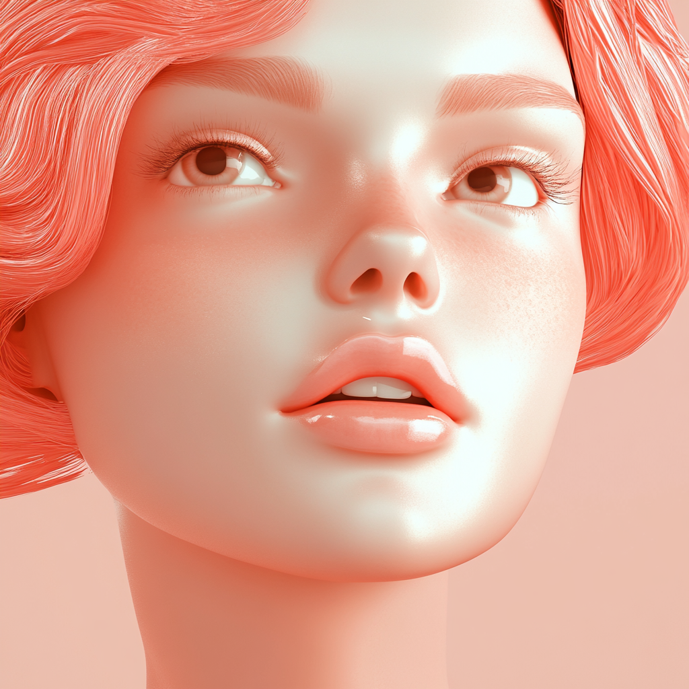

Le but de cet exercice est d'appliquer un Style avec des Images de Référence.

***

[📁 Document de départ](../assets/image/04_pot_rose.png){ .md-button }    
[📁 Document de départ](../assets/image/02_rosie.png){ .md-button }    

## Étapes

- [ ] **Télécharger l'image de référence (Rosie)** :
   - Sélectionne l'icône de personnage dans le prompt pour attacher l'image en tant que référence de **caractère**. Cela indique à l’IA de s’inspirer des caractéristiques de cette image pour le sujet principal.

- [ ] **Télécharger l'image de référence (le pot rose)** :
   - Sélectionne l'icône de trombone dans le prompt pour attacher l'image en tant que **style**. Cela permettra à l’IA de s’inspirer du style visuel ou des couleurs de cette image.

- [ ] **Écrire un prompt pour l'image** :
   - Rédige un prompt détaillé pour guider l’IA dans la création de l’image. Par exemple :
     - *"Front view. A portrait of a young woman, with her face, skin, hair, and shoulders completely covered in shiny pink plastic. The background is a solid pink color."*

- [ ] **Appliquer le poids du style avec le paramètre `--sw`** :
  - Le code `--sw` permet de gérer l’intensité du style appliqué, basé sur l’image de référence. La valeur par défaut est 100. 
    - **0** désactive le style, **100** est le niveau normal, et **1000** est l'intensité maximale.
    - **Exemple** : `--sw 1000` pour appliquer un style très fort.

- [ ] **Appliquer le poids du personnage avec le paramètre `--cw`** :
  - Le code `--cw` permet de gérer l’intensité d'influence de l'image du personnage de référence. La valeur par défaut est également 100.
    - **0** désactive l'influence du personnage, **100** est le niveau standard, et **1000** est l'influence maximale.
    - **Exemple** : `--cw 40` pour appliquer plus de style et moins de caractéristiques de l'image du personnage.

- [ ] **Appliquer le style de façon plus intense ("Vary Strong")** :
   - Après avoir généré l'image, cliquez sur l'option **"Vary (Strong)"** pour renforcer le style appliqué à l’image sélectionnée.

[📖 Consulter la page suivante](../ai/prompt.md) pour plus d’informations sur la rédaction d'un prompt efficace. 
[📖 Consulter la page suivante](../ai/midjourney_code.md) pour plus d’informations sur la rédaction de code dans Midjourney.  
***

## Tutoriel 📚

[📖 Pour en savoir plus](https://uqam-my.sharepoint.com/:v:/g/personal/lavoie-pilote_francoise_uqam_ca/Ecu9NoX_fEROjM1zxQVqLFYBunRYcSSKgtZ3_plSaRe2Iw?nav=eyJyZWZlcnJhbEluZm8iOnsicmVmZXJyYWxBcHAiOiJPbmVEcml2ZUZvckJ1c2luZXNzIiwicmVmZXJyYWxBcHBQbGF0Zm9ybSI6IldlYiIsInJlZmVycmFsTW9kZSI6InZpZXciLCJyZWZlcnJhbFZpZXciOiJNeUZpbGVzTGlua0NvcHkifX0&e=cucILZ){ .md-button }    

