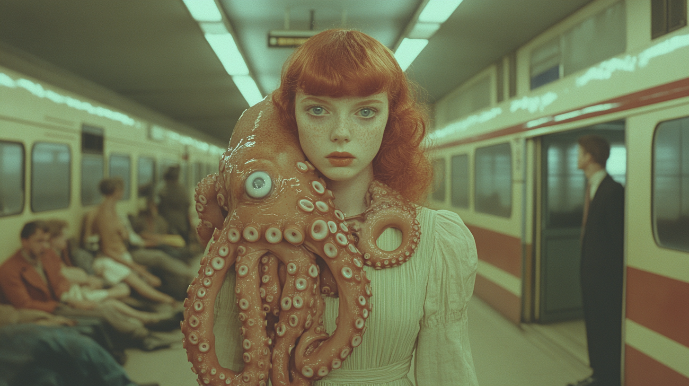

Le but de cet exercice est d'éditer une image dans Midjourney

***

[📁 Document de départ](../assets/image/04_rosie_pieuvre.png){ .md-button }    

## Étapes

- [ ] **Aller dans l'éditeur** :
   - Ouvre l'image que tu souhaites modifier dans Midjourney et accède à l'éditeur intégré.
   - Sélectionne la zone spécifique de l'image que tu veux changer, comme une partie du visage, le fond, ou un autre détail.

- [ ] **Écrire un prompt pour l'image** :
   - Rédige un nouveau prompt qui décrit précisément le changement souhaité. Utilise des instructions claires pour que Midjourney applique la modification. 
     - **Exemple** : *"Make the eye smaller"* pour réduire la taille de l'œil ou *"Change background to a sunset scene"* pour modifier le décor.

- [ ] **Soumettre la tâche** :
   - Confirme les modifications et soumets la tâche. Midjourney générera une version de l'image en fonction des modifications demandées dans le prompt.

  
[📖 Consulter la page suivante](../ai/prompt.md) pour plus d’informations sur la rédaction d'un prompt efficace.

***

## Tutoriel 📚

[📖 Pour en savoir plus](https://uqam-my.sharepoint.com/:v:/g/personal/lavoie-pilote_francoise_uqam_ca/Efk4CQI5dChFvGu74obP5IEB82LdAIGY_vFOQHHdcXNTrA?nav=eyJyZWZlcnJhbEluZm8iOnsicmVmZXJyYWxBcHAiOiJPbmVEcml2ZUZvckJ1c2luZXNzIiwicmVmZXJyYWxBcHBQbGF0Zm9ybSI6IldlYiIsInJlZmVycmFsTW9kZSI6InZpZXciLCJyZWZlcnJhbFZpZXciOiJNeUZpbGVzTGlua0NvcHkifX0&e=03hkjm){ .md-button }    

